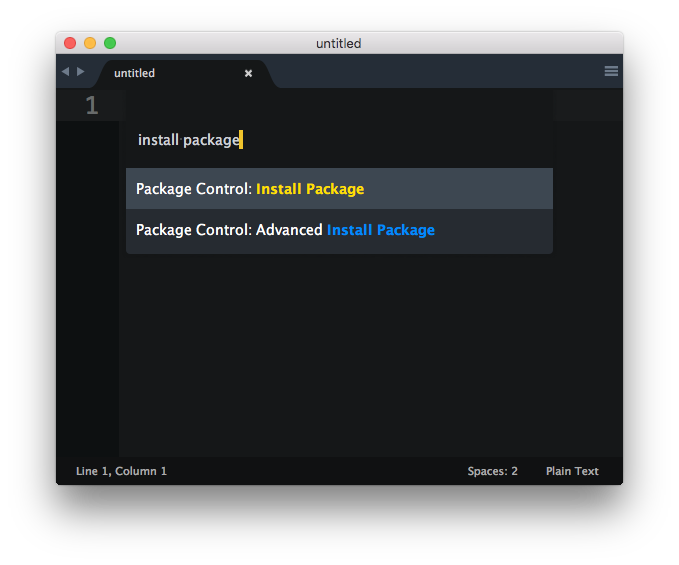

### Linter installation

Before using this plugin, you must ensure that `sass-lint` is installed on your system. To install `sass-lint`, do the following:

````
$ npm install -g sass-lint
````

**Note**: This plugin requires sass-lint 1.2.0 or later. Check your version with:
````
$ sass-lint --version.
````
Once you have installed and configured sass-lint, you can proceed to install the `SublimeLinter-contrib-sass-lint` plugin: 

### Step 4 - Install SASS Linting plugin

Please use Package Control to install the linter plugin. This will ensure that the plugin will be updated when new versions are available. If you want to install from source so you can modify the source code, you probably know what you are doing so we won’t cover that here.

To install via Package Control, do the following:

- Within Sublime Text, bring up the Command Palette and type install. Among the commands you should see **Package Control: Install Package**. If that command is not highlighted, use the keyboard or mouse to select it. There will be a pause of a few seconds while Package Control fetches the list of available plugins.



- Select `SublimeLinter-contrib-sass-lint` to install it.
- Reopen Sublime Text if necessary.
- SASS linting rules must be defined in a `.sass-lint.yml` file in the root directory.
